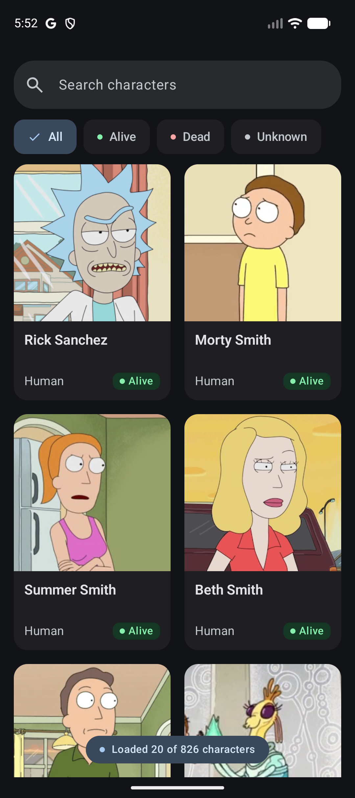
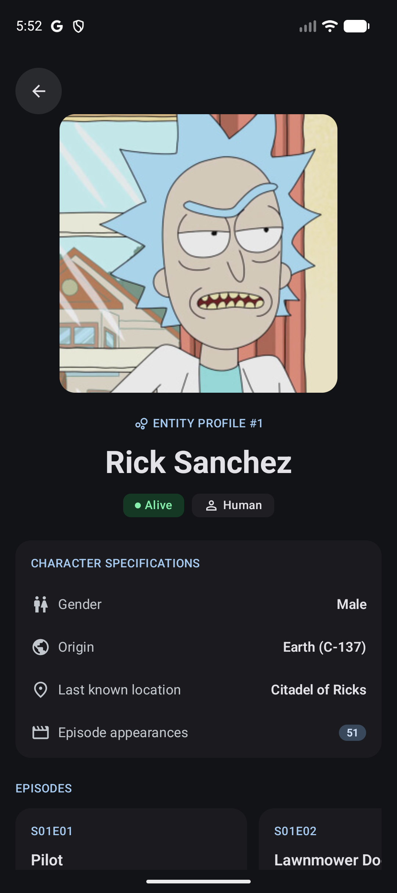
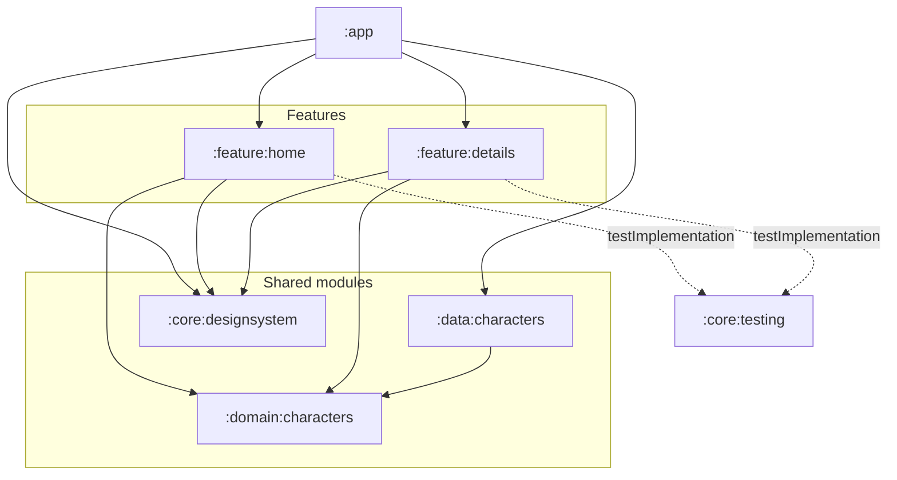

<p align="center">
  
</p>

<h1 align="center">Rick And Morty Characters</h1>

<p align="center">
  Browse characters, search by name, filter by status,<br />
  and explore character details and episode appearances.
</p>

<p align="center">
  <a href="https://github.com/asensiodev/RickAndMortyCharacters/actions/workflows/quality.yml"></a>
  <a href="app/build.gradle.kts"></a>
  
  <a href="gradle/libs.versions.toml"></a>
  <a href="gradle/libs.versions.toml"></a>
</p>

## App screenshots

<p align="center">
  
  
</p>

[Stitch references](docs/design/stitch/) document the original visual design.

## Development setup

**Build requirements:** JDK 21, Android SDK Platform 37.0 and Build Tools 36.0.0.

```sh
./gradlew :app:assembleDebug
./gradlew qualityCheck
```

## Architecture

Material 3 and Navigation 3 provide the UI/navigation; ViewModel, StateFlow and Coroutines coordinate state. Hilt composes dependencies; Retrofit, OkHttp, kotlinx.serialization, Paging and Coil handle remote data and images. ViewModels consume repositories directly; there are no use-case classes.

| Module | Responsibility |
|---|---|
| `:app` | Entry point, Hilt composition, navigation and shared image loader |
| `:feature:home` | Catalogue UI, query state and Paging integration |
| `:feature:details` | Character/episode UI and request state |
| `:domain:characters` | Pure Kotlin models, repository contracts and results |
| `:data:characters` | API/DTOs, mapping, repositories and HTTP cache |
| `:core:designsystem` | Theme, tokens and generic Compose primitives |
| `:core:testing` | Shared test support; no production dependency |



Solid arrows are production project dependencies; dotted arrows are test dependencies. Home and Detail do not depend on each other or on data implementation. Domain has no Android, Compose, Retrofit or Paging dependency.

Coil owns the shared image cache; a separate bounded OkHttp cache reuses eligible API responses according to HTTP headers. Portrait failures remain local, and neither cache guarantees offline browsing.

## Quality checks

`qualityCheck` runs JVM tests, Konsist checks for internal implementation types and read-only exposed state, ktlint, Detekt, Android Lint, Paparazzi baseline verification and debug assembly. Repository tests use deterministic HTTP fixtures; ViewModel tests use controlled responses and scheduling. Compose tests exercise screen states and production navigation. The configured [GitHub Actions workflow](.github/workflows/quality.yml) runs the aggregate gate on pushes and pull requests. Check reports are uploaded as artifacts. Instrumented suites run locally on a connected emulator or device. Instrumentation includes Home large-text and control-reachability regressions; it does not validate TalkBack or certify accessibility.

Run instrumented screen/navigation tests with a connected API 37 emulator or device:

```sh
./gradlew :feature:home:connectedDebugAndroidTest :feature:details:connectedDebugAndroidTest :app:connectedDebugAndroidTest
```

### Screenshot regressions

Paparazzi checks bounded visual contracts using controlled fixtures and reviewed PNG baselines:

```sh
./gradlew :feature:home:verifyPaparazziDebug :feature:details:verifyPaparazziDebug
```

Screenshot tests complement interaction tests and hands-on app review.

## Development approach

Built with OpenSpec, behavior-focused TDD and AI assistance, with human review and hands-on app validation. [Development process](docs/DEVELOPMENT_PROCESS.md) documents the workflow, toolchain and UI design process.

## Delivery scope

The app targets portrait phones with an English interface and the selected dark appearance. The browsing flow and bounded accessibility support were manually validated in debug on a physical Pixel 9a.

| Status | Scope |
|---|---|
| Implemented | Paginated grid/counter, combined name/status search, character facts and episode cards, retained browsing context on Back |
| Implemented | Local image feedback, loading/empty/error states, contextual Retry, image/HTTP caching, automated checks and reproducible setup |
| Implemented and manually validated | Bounded accessibility support in Home and Detail |
| Outside this delivery | Process-death restoration of search/filter state and loaded results; a complete accessibility audit across both screens |
| Outside this delivery | Light/system-theme variants, connectivity snackbar and shared-image navigation |
| Outside this delivery | Guaranteed offline catalogue, accounts, onboarding, favourites and additional destinations |

Accessibility support in Home and Detail includes labelled actions, screen-reader headings and grouped content, status/error announcements, and layouts that accommodate larger text.

[OpenSpec](openspec/) preserves change specifications and evidence as optional deeper reading.

Data and character artwork: [The Rick and Morty API](https://rickandmortyapi.com/documentation).
