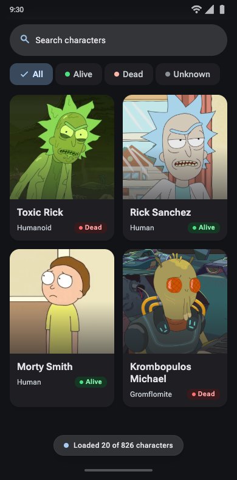
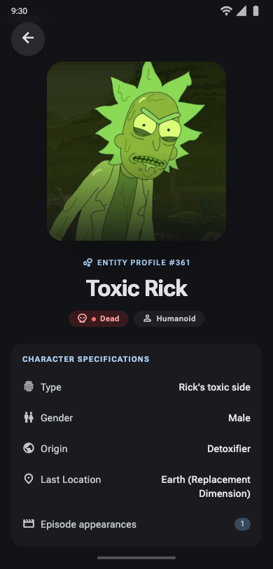

# Rick And Morty Characters

An Android app for exploring Rick and Morty characters, searching by name, filtering by status and viewing character details.

**Status:** Home loads the first remote character page and opens character details by ID. Both screens handle their applicable loading and error states; detail also handles missing characters. Back retains Home content and scroll. [C05](openspec/changes/archive/2026-10-01-character-detail-navigation/design.md) is accepted, locally validated on API 37 and archived. C01–C05 are accepted and archived; C05A architecture checks are accepted, locally validated and archived. Pagination, search/filter and HTTP response caching remain subsequent increments.

## Planned experience

- Paginated character grid with images, names and status.
- Name search combined with All, Alive, Dead and Unknown filter chips, plus quick searches when no matches are found.
- Character details and navigation back to the browsing context.
- Loading, empty and error states, retries and coherent motion.
- English UI, Compose/Material 3, image caching and HTTP response caching.

## Design preview

Selected Stitch mockups for the planned native app. See [UI/UX Definition](docs/UI_UX.md) for states and implementation adjustments.

| Home | Character detail |
|---|---|
|  |  |

## Technical direction

Home and details have separate feature modules. They share pure character-domain contracts, data access and a design system; the app composes navigation and dependencies. The six-module graph is defined in [ARCHITECTURE](docs/ARCHITECTURE.md).

Presentation follows unidirectional data flow with ViewModel/StateFlow and explicit actions. ViewModels consume repository interfaces directly; use cases are introduced where business logic warrants them. Coil 3 is configured with a shared image loader and bounded memory/disk caches. Compose interaction tests cover implemented screen states and navigation journeys; screenshot checks remain later visual verification. Hilt creates entry-scoped Home and Details ViewModels through Navigation 3; Retrofit/OkHttp and kotlinx.serialization stay inside data. Repository tests use real HTTP fixtures through MockWebServer; ViewModel tests use fakes, coroutines-test and Turbine; Home/Details screen tests use Compose with controlled images; navigation tests run the production Activity with test-only Hilt repository replacement. ktlint, Detekt, Konsist, Android Lint and a GitHub Actions workflow are configured. The previously published Quality run passed; C05A's extended gate is verified locally and awaits a remote run. The foundation toolchain and setup are documented below; the remaining libraries and checks land in their corresponding changes.

## Development setup

Open this repository root in Android Studio and sync Gradle. The tracked daemon criteria select JDK 17; install it locally and install Android SDK Platform 37.0, Build Tools 36.0.0 and Platform Tools. Configure the SDK through Android Studio, `ANDROID_HOME` or an untracked `local.properties` containing `sdk.dir=/path/to/android-sdk`.

| Foundation tool | Pinned version |
|---|---|
| Gradle wrapper | 9.4.1; distribution checksum pinned |
| Android Gradle Plugin | 9.2.1 |
| Kotlin / Compose compiler plugin | 2.4.20 |
| Compose BOM | 2026.09.00 |
| Activity Compose | 1.13.0 |
| Java / JVM target | 17 |
| Android compile / target / minimum SDK | 37.0 / 37 / 26 |

Plugin/library versions and SDK levels live in [the version catalogue](gradle/libs.versions.toml). AGP provides Kotlin support in Android modules; the domain module applies Kotlin/JVM. Build output caching, parallel module tasks and parallel IDE tooling actions are enabled in `gradle.properties`; the daemon heap remains 2 GB. No build-time improvement has been measured.

With JDK 17 selected, run from the repository root:

```sh
./gradlew :app:assembleDebug :domain:characters:build
```

The APK is written to `app/build/outputs/apk/debug/app-debug.apk`. Run the `app` configuration in Android Studio, or install and launch on a connected device:

```sh
adb install --no-streaming -r app/build/outputs/apk/debug/app-debug.apk
adb shell am start -W -n com.asensiodev.rickandmortycharacters/.MainActivity
```

The application opens the real Home grid using the shared dark Material 3 theme and requests the first unfiltered catalogue page. Selecting a card opens its detail through Navigation 3. See [C01 evidence](openspec/changes/archive/2026-09-30-android-foundation/design.md#assistance-and-validation-record) for the foundation checks and [C03 evidence](openspec/changes/archive/2026-10-01-character-card-images/design.md#validation-record) for implementation and verification.

Components have standard Android Studio previews. Home includes previews for Loading, Content, Empty and Error at ordinary and narrow/large-text sizes. Details includes ordinary-size Content, Loading, Error and NotFound previews. Previews live beside their rendering composables, with controlled images and private fixtures.

## Quality checks

```sh
./gradlew qualityCheck
./gradlew konsistCheck
./gradlew installGitHooks
```

`qualityCheck` runs ktlint 1.8.0, Detekt 2.0.0-alpha.6, Konsist 0.17.3 architecture checks, Android debug lint, JVM test tasks and debug assembly. Detekt uses its isolated CLI for source analysis without type resolution; the pinned alpha is build tooling only. Tool versions live in the catalogue. See [C02](openspec/changes/archive/2026-09-30-shared-quality-checks/design.md) for compatibility and executed validation.

`konsistCheck` verifies internal data implementation types, internal feature ViewModels and explicitly read-only state, with private mutable flow owners. It scans main sources from the six modules through test-only dependencies in domain; it also runs through `qualityCheck` and the module's `check`. See [C05A evidence](openspec/changes/archive/2026-10-01-konsist-architecture-checks/design.md#implementation-and-validation-record).

Install the hook explicitly once per clone. The pre-commit runs `ktlintCheck detekt` against working-tree source, including unstaged Kotlin changes. It never formats, stages or stashes files. Installation is repeatable and refuses to replace custom hook configuration. Full tests/build/lint remain in `qualityCheck` and CI.

Current coverage includes 34 JVM tests (17 repository + 14 ViewModel + 3 architecture), validated locally in C05A, and 20 instrumented tests (7 Home + 7 Details + 6 production navigation journeys), previously verified on API 37 in C05. Run the screen/journey suites with a connected API 37 emulator/device:

```sh
./gradlew :feature:home:connectedDebugAndroidTest :feature:details:connectedDebugAndroidTest :app:connectedDebugAndroidTest
```

Instrumented tests are not included in the current `qualityCheck` or CI workflow; they currently run locally. Screenshot regression tooling remains later optional work.

Reports: `build/reports/ktlint/ktlint.xml`, `build/reports/detekt/`, and each Android module's `build/reports/lint-results-debug.html`. JVM test reports appear in module `build/reports/tests/` when tests exist; architecture reports are in `domain/characters/build/reports/tests/konsistCheck/`. The [Quality workflow](.github/workflows/quality.yml) runs the full gate for pull requests, main pushes and manual dispatch, with pinned actions and read-only repository permissions. Reports are uploaded even after failed checks; deployment is not configured.

## Documentation

| Document | Purpose |
|---|---|
| [PRD](docs/PRD.md) | Product scope, priorities and acceptance |
| [UI/UX Definition](docs/UI_UX.md) | Screen content, components, interactions and reviewed visual references |
| [ARCHITECTURE](docs/ARCHITECTURE.md) | Module graph, state/data contracts and technical decisions |
| [DEVELOPMENT](docs/DEVELOPMENT.md) | Toolchain, design workflow, tests, CI, TDD and AI assistance |

OpenSpec holds each prepared change's requirements, tasks and evidence. [BACKLOG](docs/BACKLOG.md) preserves the remaining ordered queue and links to migrated changes; it will be retired when migration is complete. Review one bounded change before implementing it and advancing to the next.

Implementation claims, screenshots and setup instructions are added with verified changes.

Data source: [The Rick and Morty API](https://rickandmortyapi.com/documentation).
