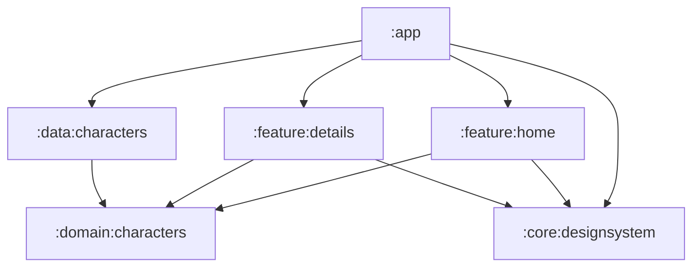

# Architecture and technical decisions

Status: the six-module foundation and shared checks are implemented. C03 adds Home card components, generic theme/loading primitives and the app-owned Coil loader, accepted and archived. Domain/data contracts, ViewModels, navigation and the real catalogue remain planned. The production entry point is a minimal Compose shell.

## Module boundaries

| Module | Responsibility | Public surface |
|---|---|---|
| `:app` | Application entry point, root navigation, dependency composition and shared image-loader configuration | Application configuration |
| `:feature:home` | Grid, search, status chips, pagination and their screen state | Home entry composable and character-selection callback |
| `:feature:details` | Character detail, loading/error state and back interaction | Detail entry composable accepting a character ID and back callback |
| `:domain:characters` | Character/query/page models and repository contract | Pure Kotlin models and interfaces |
| `:data:characters` | Repository implementation, API client and cache, DTO mapping and error translation | Dependency bindings; implementation details remain internal |
| `:core:designsystem` | Theme, design tokens and generic UI primitives | Reusable Compose foundations |



Arrows represent project dependencies. Neither feature imports the other feature or the data implementation. Domain does not depend on Android, Compose, Retrofit or Paging. DTOs and transport errors do not cross the repository interface. The design system has no character-domain dependency: `CharacterCard` belongs in home and detail-specific components in details, while theme and generic primitives belong in the design system.

This split provides compiler-enforced separation between presentation, contracts and remote implementation, plus a controlled UI foundation. Its costs are additional Gradle configuration and public APIs to maintain. Build-time improvements will not be claimed without measurements. A single module would reduce configuration but would enforce these boundaries only by convention.

The initial graph does not require a separate network module: there is one remote data owner. Extract shared networking or test utilities when a second consumer creates a concrete need. No automatic `api/impl` split is applied to every module. C01 uses direct module build files and a version catalogue. Convention plugins can be extracted when shared build policy becomes substantial enough to justify a separate build-logic module.

## Decision: separate presentation features, shared data

Home and details are separate presentation modules, each owning its screen, ViewModel, actions, state, UI mappings and tests. The app connects them through a character ID and callbacks. They share character-domain contracts and one data implementation; neither screen owns a second HTTP client or cache.

This isolates the screen implementations and allows their UI/state tests to be maintained independently. The cost is an additional module and an explicit navigation contract. A combined character feature would also be viable; separating screens here is an intentional ownership choice, not evidence of faster builds or a requirement of MVI. [Android modularization patterns](https://developer.android.com/topic/modularization/patterns).

Layer ownership remains shared for character data:

```text
:feature:home        presentation (screen, state/actions, ViewModel, components)
:feature:details     presentation (screen, state/actions, ViewModel, components)
:domain:characters   model, repository contracts; meaningful use cases if needed
:data:characters     remote service/DTOs, mapping, repository and HTTP cache
```

Do not create empty `data` and `domain` folders inside each feature or duplicate the character model and cache. Feature-owned business rules can be introduced when there is actual behavior to own; reusable rules belong with the shared domain. Package boundaries within a module are conventions, while the project graph enforces module dependencies.

## UDF/MVI presentation

Screens render immutable state and emit explicit actions. ViewModels coordinate requests and state transitions, and Compose collects state with lifecycle awareness. This is a pragmatic MVI implementation using Android UDF practices, not a dependency on a dedicated MVI framework. [Android architecture recommendations](https://developer.android.com/topic/architecture/recommendations).

Planned `HomeContent` and `DetailsContent` render immutable presentation state and callbacks independently from ViewModel/navigation wiring. Composition owns keyboard, focus and scroll objects; ViewModels own query/request state. Keep the search controls outside the results-state branch so loading or empty content does not recreate the input.

Durable loading/content/error outcomes are represented in state. A card click can invoke a navigation callback; navigation does not require a global event bus. Search, filter and load-state changes never navigate. Query changes cancel or supersede previous work, and cancellation must not be converted into a user error.

If Paging 3 is selected, its page generation and load state have one owner. The screen may consume a control `UiState` alongside a paginated flow; it must not maintain a competing list of copied items. A presentation-side PagingSource can adapt the pure repository page contract without exposing Paging types from domain. The concrete contract will be reviewed before implementation. The pure page result also carries the active query total mapped from API `info.count`. Keep that metadata tied to the same query generation as the items; obsolete results must not update the counter. Derive the loaded count from real items available in that generation, without counting placeholders or maintaining a second item list. The counter needs no separate API call; reset it with query changes.

## Direct repositories and selective use cases

ViewModels initially receive `CharactersRepository`. A domain module does not require a use-case class for every repository operation. Search and status are query parameters; input debounce belongs in presentation and HTTP encoding belongs in data.

A use case becomes appropriate for meaningful business logic or behavior shared between consumers. It can coexist with direct repository access when responsibilities remain clear. This follows the optional-domain guidance in [Android architecture](https://developer.android.com/topic/architecture/domain-layer#data-layer-access-restriction).

## API outcomes and visible states

On 2026-09-30, three public GET probes returned 404 with different contextual meanings:

| Request | Observed body | Planned application outcome |
|---|---|---|
| Filtered first page with no matching name | `{"error":"There is nothing here"}` | Empty results inside Home; retain search/chips |
| Character ID `999999999` | `{"error":"Character not found"}` | Unavailable character inside the already-open detail; retain Back |
| Catalogue page `999999999` | `{"error":"There is nothing here"}` | For a requested additional page, mark the end and retain loaded cards |

Sources: [empty query](https://rickandmortyapi.com/api/character/?name=zz_no_match_ux_review&page=1), [missing detail](https://rickandmortyapi.com/api/character/999999999), [out-of-range page](https://rickandmortyapi.com/api/character/?page=999999999). These probes characterize specific responses, not every possible 404.

Data mapping must consider the endpoint, requested page and recognized API response; status code alone is insufficient. An unrecognized 404, transport failure, 5xx or malformed response remains an appropriate request error, not evidence of an empty catalogue. Additional-page errors expose footer Retry; only a confirmed list-end outcome stops pagination. Encode these distinctions in repository fixtures so transport details do not leak into screen decisions.

## Connectivity awareness — Should

A small platform adapter in `:app` observes the default network through Android `ConnectivityManager`; keep it outside character domain/data. Use `ACCESS_NETWORK_STATE`, capability callbacks and `NET_CAPABILITY_INTERNET`/`NET_CAPABILITY_VALIDATED` rather than treating Wi-Fi attachment as internet access. Unregister callbacks when observation ends. Android's validation is a useful signal, not a guarantee that this API is reachable. [Android network-state guidance](https://developer.android.com/develop/connectivity/network-ops/reading-network-state).

The app owns connectivity state and one snackbar host across destinations. Keep an initial Unknown state separate from observed availability. Present notifications through a lifecycle-aware UI effect, with one notification per observed disconnected period; composition itself does not launch notifications. Do not queue background notifications; on foreground entry reconcile current connectivity, preserve session-level duplicate suppression and dismiss an obsolete warning. Screen ViewModels continue to own request failures and retries. Requests and cache reads remain allowed regardless of the monitor signal. No new module, third-party monitoring library, connectivity probe loop or automatic retry policy is required.

The reason for app ownership is visible behaviour: switching between home and detail during the same outage must not produce duplicate warnings. Verify initial Unknown/disconnected states, loss/recovery, repeated signals, foreground/background behaviour and destination changes with a fake monitor. Check actual network changes on a device separately.

## Images and response caching

C03 configures Coil 3.6.3 through the application’s `SingletonImageLoader.Factory`. Home accepts the shared loader and uses `coil-compose-core`; its square portrait constraints bound request size. Coil owns a 20% memory cache and a 32 MiB disk cache in `cacheDir/character_images`, with a crossfade on success. Loading and failure affect only the portrait; metadata and selection remain available. The presentation-only `CharacterCardUiModel` has no domain conversion yet. No independent bitmap cache is added. [Coil ImageLoader](https://coil-kt.github.io/coil/image_loaders/).

HTTP response caching is a Must. Configure one API OkHttp client with one bounded disk `Cache` in the app cache directory, initially targeting 10 MiB. The cache belongs to `data:characters`; its directory is distinct from Coil's image cache. Let the HTTP library own response storage and validation, without a custom JSON store or header-rewriting interceptor.

The reuse contract is:

1. An eligible first GET stores its HTTP response body and metadata.
2. An identical request can reuse a fresh cached response without network access.
3. A stale entry with an `ETag` can be revalidated using `If-None-Match`. A `304 Not Modified` permits reuse of the stored body; changed data is returned as a new response. Without a usable validator, the client fetches normally.
4. Different page/name/status URLs and detail IDs remain separate. Respect applicable `Vary`, freshness and `no-store` directives.
5. Missing or stale entries may need the network. Do not request forced cache-only or stale-on-error behavior. Fresh hits can work incidentally without connectivity; there is no guaranteed offline journey.

On 2026-09-30, GET probes of `/api/character?page=1&name=rick&status=alive` and `/api/character/1` returned `200`, an `ETag`, and `Cache-Control: public, max-age=7776000, immutable`. The advertised freshness lifetime is 90 days; this is an observation of the provider's policy, not an application constant or a guarantee for every response. The client must account for response age and recheck actual headers during implementation. No conditional request or Android cache implementation was tested by these probes.

MockWebServer tests will verify our configuration and contract: fresh reuse avoids a second request; stale data triggers conditional validation when possible; `no-store` is not retained; changed queries do not mix; and an expired entry with a failed network request does not trigger a custom stale fallback. Cache misses and eviction remain normal behavior.

References: [OkHttp Cache contract](https://github.com/lysine-dev/okhttp/blob/main/okhttp/src/commonJvmAndroid/kotlin/okhttp3/Cache.kt), [HTTP caching standard](https://httpwg.org/specs/rfc9111.html). UI-state retention on back navigation is separate from HTTP caching.
