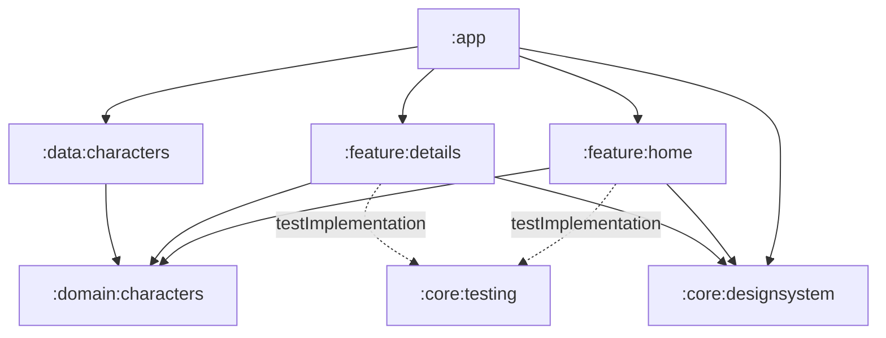

# Architecture and technical decisions

Status: the six-production-module foundation and shared checks are implemented. C03 adds Home card components, generic theme/loading primitives and the app-owned Coil loader, accepted and archived. C04 implements domain/data contracts, Hilt and repository-backed Home first-page states, accepted and archived. C05 implements character detail and typed Navigation 3 wiring, accepted, locally validated and archived. C05A architecture checks are accepted, locally validated and archived. C06 implements pagination, append recovery and the loaded/total counter, locally validated, accepted and archived. C07 adds remote name search and generation isolation; accepted and archived. C08 status filters are accepted and locally validated. C09 implements locally validated HTTP response caching, accepted for publication; archival pending; the production entry point opens Home.

## Module boundaries

| Module | Responsibility | Public surface |
|---|---|---|
| `:app` | Application entry point, root navigation, dependency composition and shared image-loader configuration | Application configuration |
| `:feature:home` | Grid, search, status chips, pagination and their screen state | Home entry composable and character-selection callback |
| `:feature:details` | Character detail, loading/error state and back interaction | Detail entry composable accepting a character ID and back callback |
| `:domain:characters` | Character/query/page models and repository contract | Pure Kotlin models and interfaces |
| `:data:characters` | Repository implementation, API client and cache, DTO mapping and error translation | Dependency bindings; implementation details remain internal |
| `:core:designsystem` | Theme, design tokens and generic UI primitives | Reusable Compose foundations |
| `:core:testing` | Kotlin/JVM support consumed only by tests | Shared JUnit 4 `MainDispatcherRule` |



Solid arrows represent production project dependencies; dotted arrows represent test dependencies. There are six production modules and one test-support module. Neither feature imports the other feature or the data implementation. Domain does not depend on Android, Compose, Retrofit or Paging. DTOs and transport errors do not cross the repository interface. The design system has no character-domain dependency: `CharacterCard` belongs in home and detail-specific components in details, while theme and generic primitives belong in the design system.

This split provides compiler-enforced separation between presentation, contracts and remote implementation, plus a controlled UI foundation. Its costs are additional Gradle configuration and public APIs to maintain. Build-time improvements will not be claimed without measurements. A single module would reduce configuration but would enforce these boundaries only by convention.

The initial graph does not require a separate network module: there is one remote data owner. Extract shared networking or test utilities when a second consumer creates a concrete need. Home and Details now share `MainDispatcherRule` through `:core:testing`, a small Kotlin/JVM support module consumed only via `testImplementation`. It exports the JUnit/coroutines-test types used by its public rule, remains outside the runtime graph and has no Android or product dependencies. No automatic `api/impl` split is applied to every module. Direct module build files use generated `projects.*` accessors for local module dependencies and the `libs.*` version catalogue for external dependencies. `settings.gradle.kts` enables `TYPESAFE_PROJECT_ACCESSORS`; this works independently of convention plugins. Convention plugins can be extracted when shared build policy becomes substantial enough to justify a separate build-logic module.

## Decision: separate presentation features, shared data

Home and details are separate presentation modules, each owning its screen, ViewModel, actions, state, UI mappings and tests. The app connects them through a character ID and callbacks. They share character-domain contracts and one data implementation; neither screen owns a second HTTP client or cache.

This isolates the screen implementations and allows their UI/state tests to be maintained independently. The cost is an additional module and an explicit navigation contract. A combined character feature would also be viable; separating screens here is an intentional ownership choice, not evidence of faster builds or a requirement of MVI. [Android modularization patterns](https://developer.android.com/topic/modularization/patterns).

Layer ownership remains shared for character data:

```text
:feature:home        presentation (screen, state/actions, ViewModel, components)
:feature:details     presentation (screen, state/actions, ViewModel, components)
:domain:characters   model, repository contracts; meaningful use cases if needed
:data:characters     remote service/DTOs, mapping, repository and HTTP cache
```

Do not create empty `data` and `domain` folders inside each feature or duplicate the character model and cache. Feature-owned business rules can be introduced when there is actual behavior to own; reusable rules belong with the shared domain. Package boundaries within a module are conventions, while the project graph enforces module dependencies.

## Source packages

Group existing files by responsibility within their module:

| Owner | Packages |
|---|---|
| Home and Details | `composables` for rendering and its layout/card tokens; `model` for immutable UI models, state and actions. Private IDE previews and their fixtures live with their rendering composables. Home adds `paging` for its internal repository adapter. Route and ViewModel remain at the feature root |
| Character domain | `model` for character/page values; `repository` for the interface and its result/failure contract |
| Character data | `remote` for API/DTOs; `repository` for the implementation; `di` for bindings |
| Design system | `theme` for colours, typography, shapes, spacing and theme composition; `composables` for generic UI primitives |

Tests mirror the package of the subject they exercise. Keep constants with their consumer and create packages only when they have content. App entry points remain at the root, with typed destinations and wiring in `navigation`; Details uses the same feature packages as Home. These folders improve navigation without changing module boundaries or adding layers.

The package refactor was assisted by Codex on 2026-10-01 and verified through `gradle_run.py`: the 16 JVM tests and seven Home tests pass on API 37; `qualityCheck` and debug/release assembly also pass. It preserves screen behavior and test boundaries.

## Executable architecture checks

C05A adds three Konsist source checks in the existing domain test sources. Data remote/repository top-level types remain internal/private; feature ViewModels remain internal; their visible state has an explicit read-only `StateFlow` type. Other outward properties declare `val` types, preventing inferred or declared mutable flow owners from escaping. The public DI replacement module remains allowed.

`konsistCheck` scans explicit main Kotlin roots and tracks those files as Gradle inputs, so feature/data edits invalidate the JVM task. It participates in `qualityCheck` and domain `check`, without a production dependency or module. These bounded checks complement compiler-enforced dependencies and behavior tests; they do not prove deep immutability or coroutine correctness. Actual failure/recovery evidence lives in [C05A](../openspec/changes/archive/2026-10-01-konsist-architecture-checks/design.md#implementation-and-validation-record).

## UDF/MVI presentation

Screens render immutable state and emit explicit actions. ViewModels coordinate requests and state transitions, and Compose collects state with lifecycle awareness. This is a pragmatic MVI implementation using Android UDF practices, not a dependency on a dedicated MVI framework. [Android architecture recommendations](https://developer.android.com/topic/architecture/recommendations).

`HomeContent` and `DetailsContent` render immutable presentation state and callbacks independently from ViewModel/navigation wiring. Composition owns keyboard, focus and scroll objects; ViewModels own query/request state. Keep search and status controls outside the results-state branch so loading or empty content does not recreate the input.

Durable loading/content/error outcomes are represented in state. A card click can invoke a navigation callback; navigation does not require a global event bus. Search, filter and load-state changes never navigate. Query changes cancel or supersede previous work, and cancellation must not be converted into a user error.

C06 uses Paging 3.5.1. `HomeViewModel` owns one Pager, mapped to card models and cached in its lifetime; `CharactersPagingSource` adapts the pure repository contract inside Home. Paging owns items, request coordination and loading/retry states. The ViewModel exposes only the API total in read-only `HomePagingState`; it has no second accumulated list or refresh/append jobs. `HomeRoute` collects `LazyPagingItems`, references its item snapshot in a render projection and performs indexed access during lazy card rendering to supply prefetch hints. Stable keys use snapshot IDs without accessing every Paging index.

Page size and initial load size are 20, prefetch distance is 5, placeholders are disabled and loaded pages are retained for the bounded catalogue. `nextPage` drives forward traversal; there is no refresh gesture. The counter uses real presented items and the first-page API total. Confirmed append end preserves that total; errors retain the grid with footer Retry. Home owns measured overlay clearance and hides the counter while the IME is visible. C07 switches cached Pager generations for the applied name and resets pagination, counter and scroll. C08 extends the same query generation with status. New-generation content waits until the grid reset completes, so the old viewport cannot prefetch a second page for the replacement query. See [C06 evidence](../openspec/changes/archive/2026-10-01-complete-catalogue-pagination/design.md).

## Implemented name and status filtering

Home exposes explicit Edit, Submit, Clear, Suggest and SelectStatus actions. `HomePagingState` separates raw input from the trimmed applied name, API total and generation identity. Typing waits 300 ms; keyboard Search and suggestions cancel debounce and apply immediately. Equivalent applied names preserve the generation. Clear immediately removes the name while preserving status. Selecting All removes only status; Unknown remains a real API constraint. Changing a chip applies the latest visible name immediately and cancels its pending debounce. Reselecting the active chip preserves the generation and lets pending typing finish.

The query flow uses `distinctUntilChanged` and `flatMapLatest` before `cachedIn(viewModelScope)`. Each PagingSource captures name/status/generation, supplies both constraints on every page and updates totals only for the current generation. Card models and typed Paging errors carry presentation-only generation identity so HomeRoute rejects older results/errors even while Paging replaces its snapshot. Missing current items remain Loading; only a completed zero-total result becomes Empty. Paging retains ownership of data, loads and Retry without a second item list.

The repository's optional name and typed `CharacterStatus` parameters remain pure Kotlin; Retrofit query encoding and recognized filtered-first-page 404 mapping stay in data. Unfiltered first-page and malformed/unrecognized errors remain failures. Append-end and detail contracts retain their previous semantics.

HomeContent keeps search mounted outside the results branch. Compose owns text selection, focus, keyboard and grid position; a generation change resets scroll once, while ordinary Detail → Back retains it. No matches offers fixed name shortcuts on Home; query errors retain contextual Retry. No new module or dependency is required. [C07 design and evidence](../openspec/changes/archive/2026-10-01-search-characters-by-name/design.md).

## Implemented detail and navigation

`CharactersRepository.getDetails(id)` returns a pure `CharacterDetailsResult`: Success, NotFound or Failure. Data reuses the page client, validates the returned identity and maps the episode array length without related requests. Only the recognized detail 404 body is NotFound; other HTTP errors are Service, malformed required data is InvalidResponse, and I/O failures are Network. Cancellation propagates. The existing first-page catalogue 404 contract is preserved.

`DetailsViewModel` owns one entry identity and immutable Loading/Content/Error/NotFound state. Load is idempotent; Retry applies only in Error and changes state to Loading before starting work, preventing duplicate pending actions. `DetailsRoute` wires lifecycle-aware collection to stateless `DetailsContent` and receives Back as a callback.

App owns serializable Home and Detail(ID) keys through `rememberNavBackStack` and `NavDisplay`, with the saveable-state decorator before the ViewModel-store decorator. Hilt resolves ViewModels inside their entry owners. Selection is accepted only while Home is the top entry; detail Back only pops its active entry, never the root. Home's ViewModel and saveable grid position survive normal return; popping detail cancels its request owner.

The portrait uses the shared Coil loader, clipped bounds and layer-phase scroll reads. Its local effect observes the framework `MotionDurationScale` signal; scale zero disables scroll-linked translation without a second platform observer. `StatusColors` supplies the same Alive/Dead palette to both features. See [C05 evidence](../openspec/changes/archive/2026-10-01-character-detail-navigation/design.md#validation-and-ai-record) for the tests and native motion check. Process-death acceptance remains C10.

## Direct repositories and selective use cases

ViewModels initially receive `CharactersRepository`. A domain module does not require a use-case class for every repository operation. Search and status are query parameters; input debounce belongs in presentation and HTTP encoding belongs in data.

A use case becomes appropriate for meaningful business logic or behavior shared between consumers. It can coexist with direct repository access when responsibilities remain clear. This follows the optional-domain guidance in [Android architecture](https://developer.android.com/topic/architecture/domain-layer#data-layer-access-restriction).

## API outcomes and visible states

On 2026-09-30, three public GET probes returned 404 with different contextual meanings:

| Request | Observed body | Planned application outcome |
|---|---|---|
| Filtered first page with no matching name | `{"error":"There is nothing here"}` | Empty results inside Home; retain search/chips |
| Character ID `999999999` | `{"error":"Character not found"}` | Unavailable character inside the already-open detail; retain Back |
| Catalogue page `999999999` | `{"error":"There is nothing here"}` | For a requested additional page, mark the end and retain loaded cards |

Sources: [empty query](https://rickandmortyapi.com/api/character/?name=zz_no_match_ux_review&page=1), [missing detail](https://rickandmortyapi.com/api/character/999999999), [out-of-range page](https://rickandmortyapi.com/api/character/?page=999999999). These probes characterize specific responses, not every possible 404.

Data mapping must consider the endpoint, requested page and recognized API response; status code alone is insufficient. An unrecognized 404, transport failure, 5xx or malformed response remains an appropriate request error, not evidence of an empty catalogue. Additional-page errors expose footer Retry; only a confirmed list-end outcome stops pagination. C06 implements `CharactersPageResult.EndOfCatalogue` for a recognized additional-page 404, distinct from an empty first-page result or failure. Encode these distinctions in repository fixtures so transport details do not leak into screen decisions.

## Connectivity awareness — Should

A small platform adapter in `:app` observes the default network through Android `ConnectivityManager`; keep it outside character domain/data. Use `ACCESS_NETWORK_STATE`, capability callbacks and `NET_CAPABILITY_INTERNET`/`NET_CAPABILITY_VALIDATED` rather than treating Wi-Fi attachment as internet access. Unregister callbacks when observation ends. Android's validation is a useful signal, not a guarantee that this API is reachable. [Android network-state guidance](https://developer.android.com/develop/connectivity/network-ops/reading-network-state).

The app owns connectivity state and one snackbar host across destinations. Keep an initial Unknown state separate from observed availability. Present notifications through a lifecycle-aware UI effect, with one notification per observed disconnected period; composition itself does not launch notifications. Do not queue background notifications; on foreground entry reconcile current connectivity, preserve session-level duplicate suppression and dismiss an obsolete warning. Screen ViewModels continue to own request failures and retries. Requests and cache reads remain allowed regardless of the monitor signal. No new module, third-party monitoring library, connectivity probe loop or automatic retry policy is required.

The reason for app ownership is visible behaviour: switching between home and detail during the same outage must not produce duplicate warnings. Verify initial Unknown/disconnected states, loss/recovery, repeated signals, foreground/background behaviour and destination changes with a fake monitor. Check actual network changes on a device separately.

## Images and response caching

C03 configures Coil 3.6.3 through the application’s `SingletonImageLoader.Factory`. Home accepts the shared loader and uses `coil-compose-core`; its square portrait constraints bound request size. Coil owns a 20% memory cache and a 32 MiB disk cache in `cacheDir/character_images`, with a crossfade on success. Loading and failure affect only the portrait; metadata and selection remain available. Home maps domain summaries into the presentation-only `CharacterCardUiModel`. No independent bitmap cache is added. [Coil ImageLoader](https://coil-kt.github.io/coil/image_loaders/).

C09 configures the singleton API OkHttp client with a 10 MiB disk `Cache` in `cacheDir/character_http`, distinct from Coil's `character_images`. The internal client factory and Hilt composition belong to `data:characters`; catalogue and detail share the client. OkHttp owns storage and validation without a custom JSON store or header-rewriting interceptor.

The reuse contract is:

1. An eligible first GET stores its HTTP response body and metadata.
2. An identical request can reuse a fresh cached response without network access.
3. A stale entry with an `ETag` can be revalidated using `If-None-Match`. A `304 Not Modified` permits reuse of the stored body; changed data is returned as a new response. Without a usable validator, the client fetches normally.
4. Different page/name/status URLs and detail IDs remain separate. Respect applicable `Vary`, freshness and `no-store` directives.
5. Missing or stale entries may need the network. Do not request forced cache-only or stale-on-error behavior. Fresh hits can work incidentally without connectivity; there is no guaranteed offline journey.

On 2026-09-30, GET probes of `/api/character?page=1&name=rick&status=alive` and `/api/character/1` returned `200`, an `ETag`, and `Cache-Control: public, max-age=7776000, immutable`. The advertised freshness lifetime is 90 days; this is an observation of the provider's policy, not an application constant or a guarantee for every response. The client must account for response age and recheck actual headers during implementation. No conditional request or Android cache implementation was tested by these probes.

C09 has 14 passing repository/MockWebServer cache tests covering fresh catalogue/detail reuse, reopened disk storage, stale ETag/304 validation, changed bodies, no-validator requests, page/name/status/ID/Vary separation, no-store/no-cache, expired transport/service failures and cleared storage. Existing repository cancellation and contextual-error tests also pass. Cache misses and eviction remain normal behavior. Current provider headers and exact validation evidence are recorded in [C09](../openspec/changes/cache-character-http-responses/design.md#implementation-and-validation-record).

References: [OkHttp Cache contract](https://github.com/lysine-dev/okhttp/blob/main/okhttp/src/commonJvmAndroid/kotlin/okhttp3/Cache.kt), [HTTP caching standard](https://httpwg.org/specs/rfc9111.html). UI-state retention on back navigation is separate from HTTP caching.
